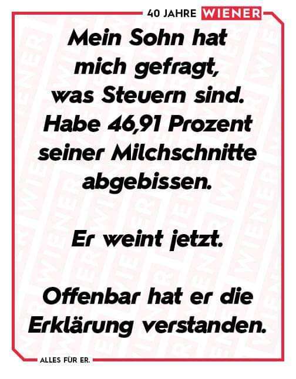
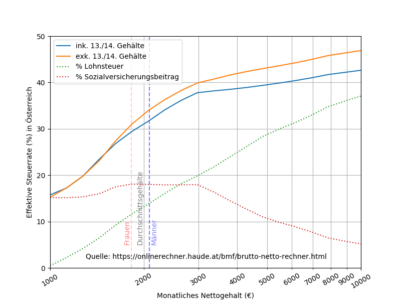
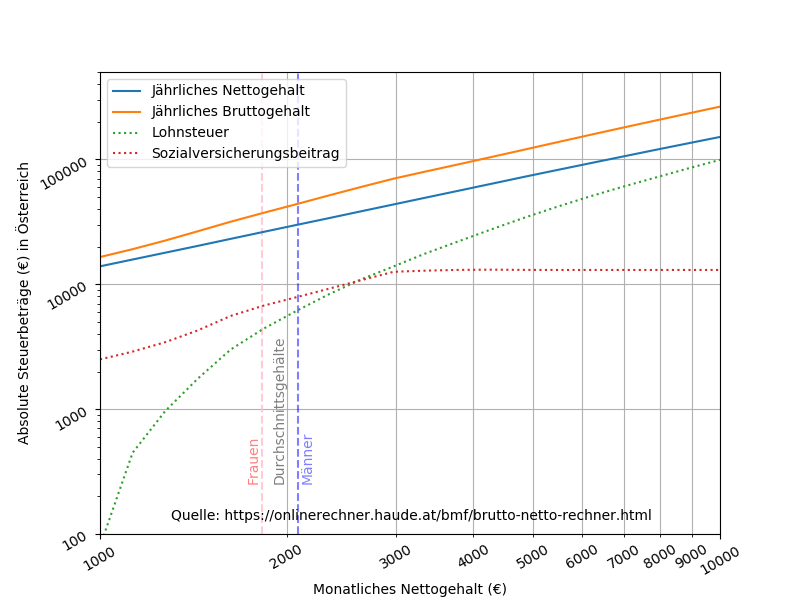

# A short rant about the problem with the public's perception of taxes

### Background
A friend of mine posted this joke in one of my WhatsApp groups:

To which I though: that's funny, but it leaves out the fact that the parent is 
providing the child with food, a roof over their head, child-care, amenities, 
toys, etc, much the same way that the state provides it's citizens with road,
hospitals, public housing, education, social welfare, etc. However if the child 
was given the choice between living alone in the forest with wolves, or in a 
house with all the modern day comforts, I'm sure he would gladly give up half of
his Milchschnitte.

Unfortunately the fact that we all find this joke funny is indicative of our 
level of education concerning taxes. Most of us don't make the connection 
between the tax man collecting a percentage of our wage each month, and the 
quality of the services and infrastructure that we encounter in our everyday 
lives. It's an incredibly basic concept that we either choose to ignore because 
we're greedy, or have never really been taught or thought about: without taxes, 
we would not have the world we live in.

The other part of that joke that got me thinking was the 46.91%. As much as we 
all like to complain about taxes being too high, the vast majority of us don't 
actually pay all that much tax. So that I could be armed with the facts for 
the next time this topic came up in a discussion, I did a little research. 
Here we have the relative percentages of the two major sources of tax in 
Austria - the income tax and the social welfare contribution (a.k.a tax) - 
plotted against the monthly net income:

  

As we can see, income tax - the tax that is used for everything other than 
social welfare (unemployment money, health care, etc) - is basically nothing 
for those earning ~1000€ per month, and even for those earning a good 
upper middle class income of ~3000€ per month, the income tax is still less than 
20% of the total monthly wage. To put some context to the wage numbers, the 
average austrian man working 40 hours per week earns €2090 per month, 
while his female counterpart earns just €1824 per month 
([Source](http://www.statistik.at/web_de/statistiken/menschen_und_gesellschaft/soziales/personen-einkommen/jaehrliche_personen_einkommen/index.html)),
a difference of 13%.

The other major "tax", the so called social welfare contribution, is a flat 18%
for all austrian workers up to a maximum of €13.000 per year. If you earn over 
€3000 per month net then your social welfare contributions become an decreasing
proportion of your actual wage. This cap can be seen in the next graph:

In my opinion the austrian social welfare system is one of the best in the 
world. The state takes care of you through thick and thin. Just to name a few
of the benefits that Austria affords its citizens:
- minimum 12 months paid maternity leave (plus an additional 2 months for the father)
- pension payments at ~60% of your last wage for life
- extremely short elective surgery waiting lists (~weeks, not months)
- unlimited sick-leave
- "burnout" is a valid reason to take paid sick-leave
- 6 months unemployment benefits at ~60% of your last wage

I'm sure there are also many other benefits that I have yet to take advantage
of. However given all this, I for one am happy to put 18% of wage towards 
keeping such a system funded and running smoothly. 

To sum up, the taxes we pay are an important part of life in a functioning
society. Without them, much of what we take for granted wouldn't exist. So the
next time someone complains about the tax rate (even in the form of a joke), my
answer will be to tell them to pull their finger out and take a look at the
world around them.

